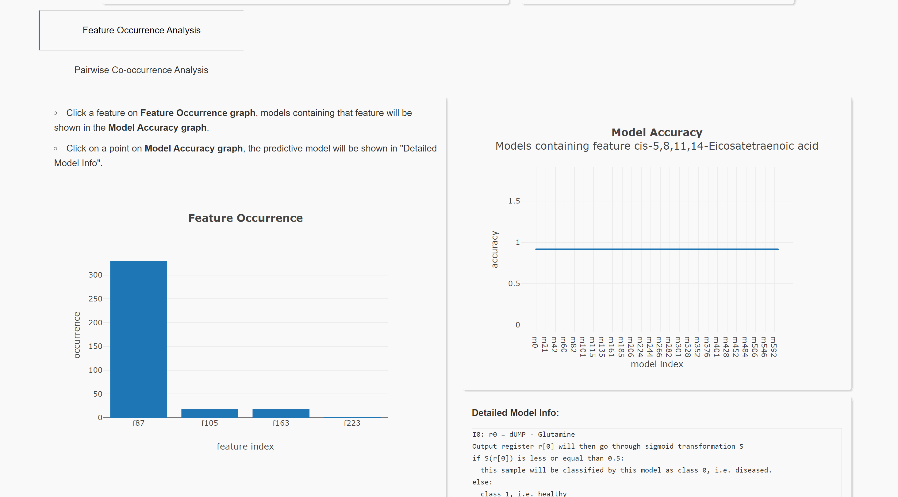
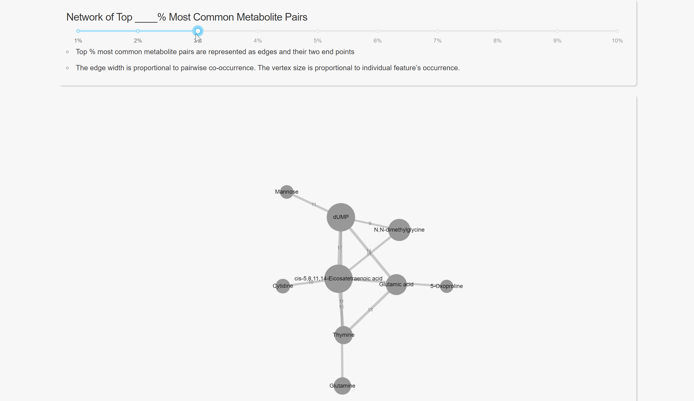

.. image:: https://readthedocs.org/projects/smile-mib/badge/?version=latest
    :target: https://smile-mib.readthedocs.io/en/latest/?badge=latest
    :alt: Documentation Status
.. image:: https://api.codacy.com/project/badge/Grade/c8897f8173434a8798896a8f94d0c2c0
    :target: https://www.codacy.com/manual/ChengyuanSha/linear_genetic_programming?utm_source=github.com&amp;utm_medium=referral&amp;utm_content=ChengyuanSha/linear_genetic_programming&amp;utm_campaign=Badge_Grade
.. image:: https://badge.fury.io/py/lgp.svg
    :target: https://badge.fury.io/py/lgp

Systems Metabolomics using Interpretable Learning and Evolution (SMILE)
=======================================================================
**SMILE** package implements Linear Genetic Programming (LGP) algorithm in python, with a scikit-learn style API. It is
mainly used in data mining and finding feature interactions. Note it currently only support binary classification data.

Video Tutorial
--------------
Quick tutorial on SMILE framework: https://youtu.be/7sPdUTrNIZs

Installation
------------
This package is published on pypi. Install using pip.

.. code-block:: python

    pip install lgp

Running the algorithm
---------------------
This algorithm is **computationally expensive**, and it needs to run approximately 1000 times in parallel to produce enough
data to analyze. it needs to run in computer clusters like `compute canada. <https://www.computecanada.ca/>`_

Create a running python file (Run.py) in the same directory as lgp folder, Sample Run.py and classifier usages are shown below:

.. code-block:: python

    from linear_genetic_programming.lgp_classifier import LGPClassifier
    from sklearn.model_selection import train_test_split
    from sklearn.metrics import accuracy_score
    from sklearn import metrics

    # preprocess your data, get data matrix X, label y and names
    # X, y are in scikit-learn style
    X, y, names
    X_train, X_test, y_train, y_test = train_test_split(X, y, test_size=0.2, random_state=1)
    # set own parameter here
    lgp = LGPClassifier(numberOfInput = X_train.shape[1], numberOfVariable = 200, populationSize = 20,
                            fitnessThreshold = 1.0, max_prog_ini_length = 40, min_prog_ini_length = 10,
                            maxGeneration = 2, tournamentSize = 4, showGenerationStat=False,
                            isRandomSampling=True, maxProgLength = 500)
    lgp.fit(X_train, y_train)
    y_pred = lgp.predict(X_test)
    y_prob = lgp.predict_proba(X_test)[:, 0]
    lgp.testingAccuracy = accuracy_score(y_pred, y_test)
    # calculate F1, AUC scores
    f1_scores = metrics.f1_score(y_test, y_pred, pos_label=0)
    fpr, tpr, thresholds = metrics.roc_curve(y_test, y_prob, pos_label=0)
    auc_scores = metrics.auc(fpr, tpr)
    # store F1, AUC in validationScores
    lgp.validationScores = {'f1':f1_scores, 'auc':auc_scores}
    # the result can be saved by calling save_model(). It will produce a pickle file.
    # save_model() use pickle for object serialization
    lgp.save_model()

Then use **bash file** to set running parameters and submit jobs. This might be different in different supercomputers.
Here is an example Bash running script in Compute Canada:

.. code-block:: console

    #!/bin/bash
    #SBATCH --time=10:00:00
    #SBATCH --array=1-1000
    #SBATCH --mem=500M
    #SBATCH --job-name="lgp"

    python Run.py

Result Visualization
----------------------
Preparation of two files
^^^^^^^^^^^^^^^^^^^^^^^^
1. ``.pkl`` file is produce (using ``save_model()`` method) when running the algorithm

2. ``.csv`` is the original dataset file. Make sure you named the class column 'category' and put feature names as column names. The dataset is read using the following pandas code.

File error checking: Download error checking file `input_file_error_checking.py <https://github.com/ChengyuanSha/LGPWeb/blob/master/input_file_error_checking.py>`_.
Put your prepared files in the same directory and run ``input_file_error_checking.py``.

Web
^^^^^
Upload result files to `result visualization website (herokuapp hosting). <https://smile-mib.herokuapp.com/>`_
or `result visualization website (Queen's CS hosting). <https://smile-mib.cs.queensu.ca/>`_
This will help you visualize the result.
Note the herokuapp web server uses ephemeral filesystem, that means all files are lost
when you restart the web.

Local
^^^^^^^
You can also run the visualization locally. Download `website source code. <https://github.com/ChengyuanSha/LGPWeb>`_
After installing all requirements (listed in requirements.txt), you can run this website in your local browser.

Visualization Demo
-------------------
Feature Occurrence Analysis

|

Pairwise Co-occurrence Analysis

.. image:: assets/pairwise_co-occurrence_analysis.gif

|

Network Analysis

Reference
---------
Linear_Genetic_Programming_.
Authors: Brameier, Markus F., Banzhaf, Wolfgang

.. _Linear_Genetic_Programming: https://www.springer.com/gp/book/9780387310299
